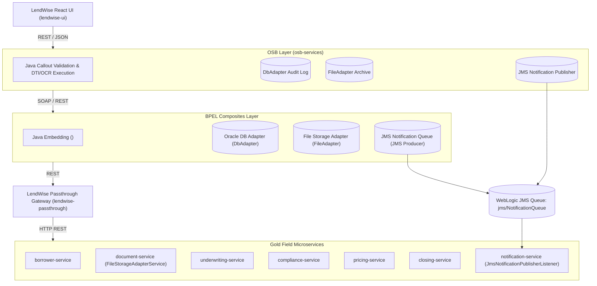

# LendWise Mortgage System - Complete End-to-End Application Flow Architecture

This document presents the complete architectural end-to-end execution flow of the **LendWise Mortgage System**, incorporating all **Oracle SOA Suite BPEL Composites**, **Oracle Service Bus (OSB) Pipelines**, **Spring Boot Passthrough Gateway**, **Gold Field Backend Microservices**, and newly integrated **DbAdapters**, **FileAdapters**, **Java Adapters**, and **JMS Queue Publishers**.

---

## 1. High-Level Architectural Flow Overview



---

## 2. End-to-End Mortgage Business Flows

### Flow 1: Borrower Application Intake & Verification

```
[Borrower UI] -> (POST /api/borrower)
     │
     ▼
[BorrowerIntakeOSB Proxy]
     │──> [Java Callout]: DTICalculator.calculateFrontEndDTI()
     │──> [DbAdapter]: Write OSB Intake Audit Log
     │──> [FileAdapter]: Archive raw JSON/XML Intake Payload
     ▼
[BorrowerIntakeComposite (BPEL)]
     │──> [Java Embedding]: Java DTI & Risk Calculation
     │──> [DbAdapter]: Insert Borrower Record into Oracle DB
     │──> [FileAdapter]: Save Borrower Application PDF Summary
     │──> [JMS Publisher]: Publish event to jms/NotificationQueue
     ▼
[Passthrough Gateway] -> [Gold Field borrower-service & kyc-service]
     ▼
[JmsNotificationPublisherListener] -> Dispatches Email/SMS Confirmation
```

---

### Flow 2: Document Intake, OCR Processing & File Archiving

```
[Borrower UI] -> (POST /api/documents/upload)
     │
     ▼
[DocumentProcessingOSB Proxy]
     │──> [Java Callout]: OCRProcessor.calculateConfidence()
     │──> [FileAdapter]: Archive incoming base64 document
     ▼
[DocumentProcessingComposite (BPEL)]
     │──> [Java Embedding]: Image OCR Extraction & Data Parsing
     │──> [DbAdapter]: Store Document Metadata in DocumentDB
     │──> [FileAdapter Outbound]: Store raw file to target archive directory
     │──> [JMS Publisher]: Publish DOCUMENT_PROCESSED event to jms/NotificationQueue
     ▼
[Gold Field document-service]
     │──> FileStorageAdapterService.writeDocumentToFile()
```

---

### Flow 3: Underwriting & Automated Credit Decision

```
[Loan Officer UI] -> (POST /api/underwriting/evaluate)
     │
     ▼
[UnderwritingOSB Proxy]
     │──> [Java Callout]: DecisionEngine.evaluateLoan()
     │──> [DbAdapter]: Write Underwriting OSB Audit Record
     ▼
[UnderwritingComposite (BPEL)]
     │──> [Java Embedding]: Rules evaluation (DTI <= 43%, LTV <= 80%, Credit >= 620)
     │──> [DbAdapter]: Insert Decision Record into Underwriting DB
     │──> [FileAdapter]: Generate and write Underwriting Audit Report
     │──> [JMS Publisher]: Publish UNDERWRITING_DECISION_GENERATED event to jms/NotificationQueue
     ▼
[Passthrough Gateway] -> [Gold Field underwriting-service & credit-service]
```

---

### Flow 4: TRID & QM Compliance Verification

```
[System Trigger / UI] -> (POST /api/compliance/check)
     │
     ▼
[ComplianceOSB Proxy]
     │──> [DbAdapter]: Write Compliance Audit Trail
     ▼
[ComplianceComposite (BPEL)]
     │──> [Java Embedding]: Check TRID 3-day rule & QM APR vs APOR threshold
     │──> [DbAdapter]: Write Compliance Certificate to ComplianceDB
     │──> [FileAdapter]: Write Compliance Certificate Document to File Archive
     │──> [JMS Publisher]: Publish COMPLIANCE_CHECK_COMPLETED event to jms/NotificationQueue
     ▼
[Passthrough Gateway] -> [Gold Field compliance-service]
```

---

### Flow 5: Pricing Engine, Amortization & Rate Lock

```
[Loan Officer UI] -> (POST /api/pricing/quote)
     │
     ▼
[PricingEngineOSB Proxy]
     │──> [Java Callout]: AmortizationCalculator.calculateMonthlyPayment()
     │──> [FileAdapter]: Archive Pricing Request
     ▼
[PricingEngineComposite (BPEL)]
     │──> [Java Embedding]: Full Amortization Schedule Calculation
     │──> [DbAdapter]: Store Rate Lock & Quote Details in PricingDB
     │──> [FileAdapter]: Write Pricing Quote Document to File System
     │──> [JMS Publisher]: Publish RATE_LOCK_EXECUTED event to jms/NotificationQueue
     ▼
[Passthrough Gateway] -> [Gold Field pricing-service & ratelock-service]
```

---

### Flow 6: Closing Disclosure Generation, eSign & Delivery

```
[Closing Agent UI / JMS Queue] -> (POST /api/closing/generate)
     │
     ▼
[ClosingDisclosureOSB Proxy]
     │──> [FileAdapter]: Archive Closing Request
     ▼
[ClosingDisclosureComposite (BPEL)]
     │──> [Java Embedding]: Calculate Cash to Close & TRID Earliest Closing Date
     │──> [DbAdapter]: Save Closing Disclosure Record to ClosingDB
     │──> [FileAdapter]: Archive Closing Disclosure Package File
     │──> [eSign REST Call]: Call DocuSign API to generate eSign envelope
     │──> [JMS Publisher]: Publish CLOSING_DISCLOSURE_READY event to jms/NotificationQueue
     ▼
[JmsNotificationPublisherListener] -> Sends eSign URL to Borrower Email
```

---

## 3. Comprehensive Summary of Integrated Adapters

| Adapter Type | Technology Stack | OSB Layer (`osb-services`) | SOA BPEL Layer (`soa-composites`) | Microservices Layer (`gold-field-services`) |
| :--- | :--- | :--- | :--- | :--- |
| **DbAdapter** | Oracle DB / JCA / Spring Data | `AuditDBBusinessService.bsp` (Audit Log) | `BorrowerIntakeDB`, `DocumentDB`, `DatabaseAdapter`, `ComplianceDB`, `PricingDB`, `ClosingDB` | Spring Data JPA Repositories |
| **FileAdapter** | File JCA / FileSystem | `FileArchiveBusinessService.bsp` (Payload Archive) | `FileAdapterOutbound` across all 6 BPEL composites | `FileStorageAdapterService.java` (`document-service`) |
| **Java Adapter** | Java Callout / `<bpelx:exec>` | `<con3:java-callout>` stages in OSB pipelines | Java Embeddings in BPEL for `DTICalculator`, `OCRProcessor`, `DecisionEngine`, `AmortizationCalculator` | Spring `@Service` Java utility components |
| **JMS Queue Publisher** | WebLogic JMS / Spring JMS | `JMSNotificationBusinessService.bsp` (Publishing to `jms/NotificationQueue`) | `NotificationQueue` partnerLinks in all BPEL processes | `JmsNotificationPublisherListener.java` (`notification-service`) |

---

## 4. Oracle SOA Suite `composite.xml` Entry & Exit Flow Architecture

In Oracle SOA Suite (SCA - Service Component Architecture), each `composite.xml` file defines the **assembly, entry points, internal business logic, exit points, and wiring** of an enterprise composite service.

### Architectural Entry/Exit Flow

```
 ┌────────────────────────────────────────┐
 │           ENTRY FLOW (Inbound)         │
 │   • SOAP Service (<binding.ws>)        │
 │   • REST Service (<binding.rest>)      │
 └───────────────────┬────────────────────┘
                     │  wired via <wire>
                     ▼
 ┌────────────────────────────────────────┐
 │           INTERNAL COMPONENT           │
 │   • BPEL Process (<implementation.bpel>)│
 │   • Java Adapters / Business Logic     │
 └───────────────────┬────────────────────┘
                     │  wired via <wire>
                     ▼
 ┌────────────────────────────────────────┐
 │           EXIT FLOW (Outbound)         │
 │   • Pass-through REST (<binding.rest>) │
 │   • DB / File / JMS (<binding.jca>)    │
 └────────────────────────────────────────┘
```

### Entry Flow (`<service>`)
Defines how upstream callers (`lendwise-ui` or OSB Gateway Proxies) send requests into the composite via `<service>` tags bound to REST/SOAP ports.

### Exit Flow (`<reference>`)
Defines outbound integration endpoints using `<reference>` tags bound to REST microservices (`lendwise-passthrough`), JCA Database Adapters, JCA File Adapters, and JCA JMS Publishers.
